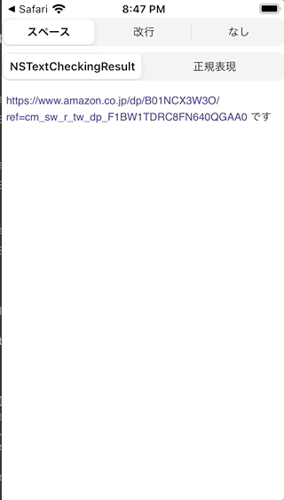
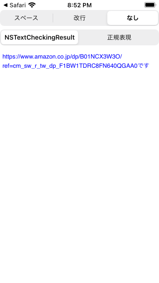
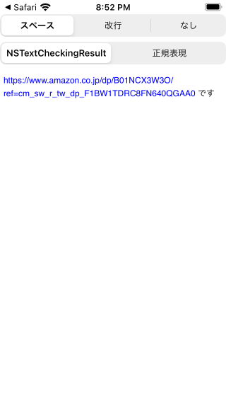
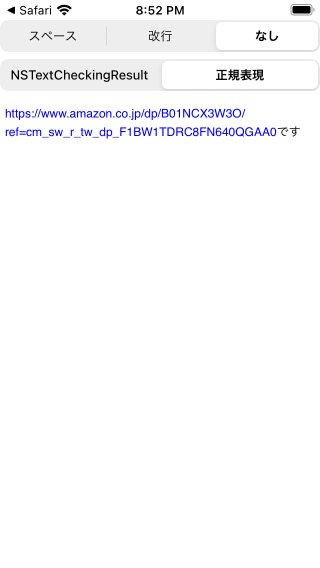

# linkSample

# NSTextCheckingResult.CheckingType.link

URL抽出に使う、Stringの配列で受け取れる

```swift:実装例
let check = try! NSDataDetector(types: NSTextCheckingResult.CheckingType.link.rawValue)
let match = check.matches(in: self, options: [], range: NSMakeRange(0, self.count))
let urls: [String] = match.compactMap { (self as NSString).substring(with: $0.range) }
```

NSAttributedStringと組み合わせてUITextViewにリンクを挿入するときなどに使う

```swift:実装例
let textView = UITextView()
let attributeString = NSMutableAttributedString(string:textView.text)
urls.forEach { url in
    attributeString.addAttribute(.link,
                                 value: url,
                                 range: NSString(string: content.text).range(of: url))
}
textView.attributedText = attributeString
```




# URLの後ろすぐに日本語がついている場合
すべてURLとして処理される




半角スペースもしくは改行をすれば正常に動作する。




英語圏だとURLと見分けがつかないから必然的に改行もしくはスペースが入るわけで
こういうケースがあるのは日本語含む非英語圏ならではなのかと思う🙄

# 自由入力でリンクをつきのUITextViewを作るなら正規表現が良い

```swift:実装例
let pattern = "(http://|https://){1}[0-9a-zA-Z\\.\\-/:!#$%&@=?_]+"
let regex = try! NSRegularExpression(pattern:pattern, options:[])
guard let range = self.range(of:self) else { return [] }
let urls: [String] = regex.matches(in:self, range:NSRange(range, in: self)).map { String(self[Range($0.range, in:self)!]) }
```



